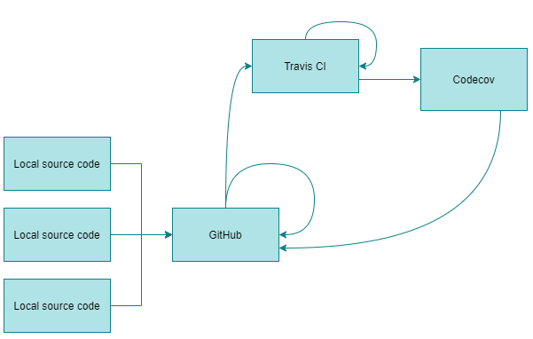

# Software Testing Labwork

### Current status

[](https://travis-ci.com/AppLoidx/SoftwareTestingLabWork)
[](https://codecov.io/gh/AppLoidx/SoftwareTestingLabWork)


## Maven JUnit test

Run test:
```shell
mvn clean test
```


### Examples
Some test examples. Total test cases : 41. Code coverage [](https://codecov.io/gh/AppLoidx/SoftwareTestingLabWork)

#### Sin test

[*Source code*](https://github.com/AppLoidx/SoftwareTestingLabWork/blob/master/src/test/java/com/itmoprofessionals/softwaretest/math/SuperMathTest.java)

```java
@Test
void sin_zeroTest() {
    assertEquals(0, SuperMath.sin(0));
}

@Test
void sin_zeroSignedTest() {
        assertEquals(-0, SuperMath.sin(-0));    // should have the same sign
}

@Test
void sin_NaNTest() {
        assertEquals(Double.NaN, SuperMath.sin(Double.NaN));
}

@Test
void sin_InfTestNegative() {
        assertEquals(Double.NaN, SuperMath.sin(Double.NEGATIVE_INFINITY));
}

@Test
void sin_InfTestPositive() {
        assertEquals(Double.NaN, SuperMath.sin(Double.POSITIVE_INFINITY));
}
```

#### DFS test
[*Source code*](https://github.com/AppLoidx/SoftwareTestingLabWork/tree/master/src/test/java/com/itmoprofessionals/softwaretest/graph)

```java
@Test
void dfsSampleCheckTest() {
    Node sampleNode = GraphUtil.createSampleGraph();
    LinkedList<Node> path = new LinkedList<>();
    DFS.applyTo(sampleNode, path::add);

    assertEquals(1, path.get(0).getId());
    assertEquals(2, path.get(1).getId());
    Node node3 = path.get(2);

    /*
    из-за того что соседние ноды хранятся в неупорядоченном виде
    мы должны рассмотреть все варианты когда алгоритм выбирает одну или другую
    соседнюю ноду
    в этом случае, алгоритм может пройти через ноду 4 или 3 в зависимости от реализации
    */
    assertTrue(node3.getId() == 4 || node3.getId() == 3);
    assertEquals(5, path.get(3).getId());
    Node node5 = path.get(4);
    assertTrue(node5.getId() == 4 || node5.getId() == 3);
}

@Test
void dfsOneNodeTest() {
    Node sampleNode = GraphUtil.createOneNodeGraph();
    LinkedList<Node> path = new LinkedList<>();
    DFS.applyTo(sampleNode, path::add);

    assertEquals(1, path.size());
    assertEquals(path.get(0).getId(), 1);
}
```

#### Domain test
[*Source code*](https://github.com/AppLoidx/SoftwareTestingLabWork/tree/master/src/test/java/com/itmoprofessionals/softwaretest/domain)

```java
@Test
public void sceneDescription() {

    Scene scene = new Scene("Untitled");


    // В полной темноте сверкнула ослепительно яркая точка света.

    Dot dot = new Dot(1, false);
    Sun sun1 = new Sun(2, true);
    Sun sun2 = new Sun(3, true);
    Flash flashFromSun = new Flash(4);

    EventProcessor eventProcessorMock = Mockito.mock(EventProcessor.class);

    scene.setEventProcessor(eventProcessorMock);
    List<Action> actions = List.of(
            dot::appear,
            dot::spark,
            sun1::appear,
            sun2::appear,
            sun1::burn,
            sun2::burn,
            flashFromSun::light
    );

    actions.forEach(scene::applyAction);

    assertNotNull(scene.sceneDescription());
    
    when(eventProcessorMock.processEvent(any(Event.class)))
            .thenReturn("Processed event description mock");

    verify(eventProcessorMock, times(actions.size())).processEvent(any(Event.class));

}
```

```java
class SparkTest {
    @Test
    void defaultObjectTypeForSparks() {
        Spark spark = Mockito.mock(Spark.class, Mockito.CALLS_REAL_METHODS);
        assertEquals("Spark", spark.getObjectTypeName());
    }
}
```

### Continuous integration



