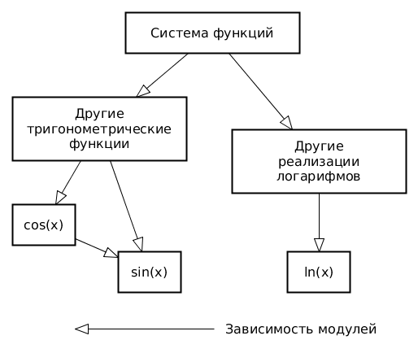

# Лабораторная работа №2 &laquo;Тестирование программного обеспечения&raquo;

Выполнили: Артур Куприянов, Екатерина Машина

Преподаватель: Дмитриева А.М.

Санкт-Петербург, 2021

Задание
=======
* Все составляющие систему функции (как тригонометрические, так и логарифмические) должны быть выражены через базовые (тригонометрическая зависит от варианта; логарифмическая -- натуральный логарифм).
* Структура приложения, тестируемого в рамках лабораторной работы, должна выглядеть следующим образом (пример приведён для базовой тригонометрической функции sin(x)):

  
* Обе "базовые" функции (в примере выше - sin(x) и ln(x)) должны быть реализованы при помощи разложения в ряд с задаваемой погрешностью. Использовать тригонометрические / логарифмические преобразования для упрощения функций ЗАПРЕЩЕНО.
* Для КАЖДОГО модуля должны быть реализованы табличные заглушки. При этом, необходимо найти область допустимых значений функций, и, при необходимости, определить взаимозависимые точки в модулях.
* Разработанное приложение должно позволять выводить значения, выдаваемое любым модулем системы, в сsv файл вида «X, Результаты модуля (X)», позволяющее произвольно менять шаг наращивания Х. Разделитель в файле csv можно использовать произвольный.

Вариант
=======

Функция
======

F1(x) при x <= 0
Периодическая функция с периодом 2pi. Функция состоит из 4 частей, каждая часть
которой уходит в бесконечность. Для тестирования были проверены все граничные
точки (точки разрыва второго рода) и точки в каждом классе эквивалентности и
проверена периодичность функций

F2(x) при x > 0
Функция была протестирована во всех классах эквивалентности, в точках экстремумов

Графики функций, полученные из экспериментальных данных:
==========

**f(x)**

.png)

**y = sin(x)**

**y = cos(x)**

**y = tan(x)**

**y = cot(x)**

**y = sec(x)**

**y = csc(x)**

**y = ln(x)**

**y = log2(x)**

**y = log10(x)**

**Ход работы**

При тестировании были написаны тесты для проверки значений во всех классах
эквивалентности, разобраны значения в граничных точках, точках экстремумов,
перегибов и разрывов первого и второго родов.

Тестирование проходило в 3 уровня: на первом уровне производилась проверка
работы системы функций. Для этого заглушки были установлены на system(x). На втором уровне заглушки устанавливались на все тригонометрические и
логарифмические функции, на третьем уровне -- на sin, cos, ln, на четвертом на sin и ln,
на пятом функции проверялись без использования каких-либо заглушек.
По полученным результатам были построены графики.

**Вывод**

В ходе выполнения лабораторной работы было проведено и изучено интеграционное
тестирование функции, были изучены основные принципы интеграционного
тестирования и была изучена среда тестирования Mockito, при помощи которого
создавались табличные заглушки в ходе выполнения лабораторной работы.

