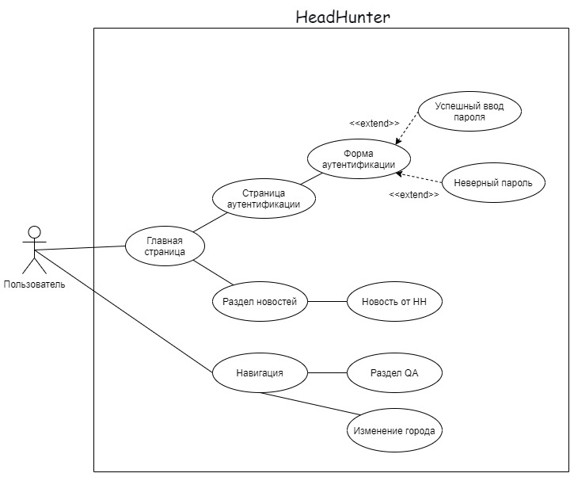
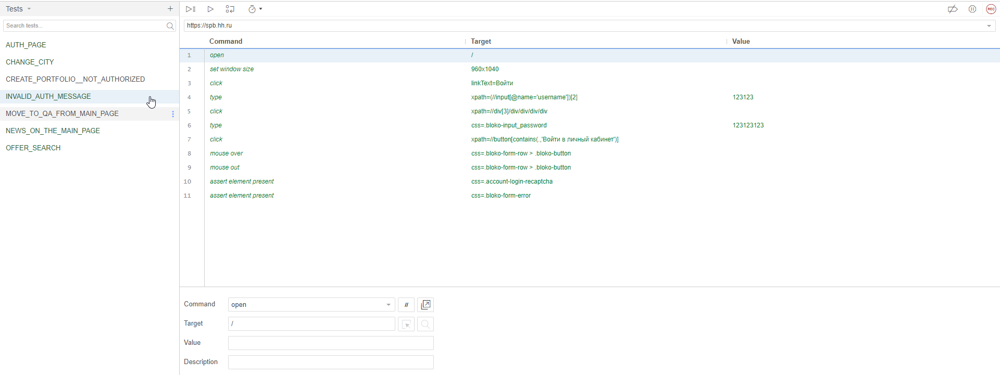
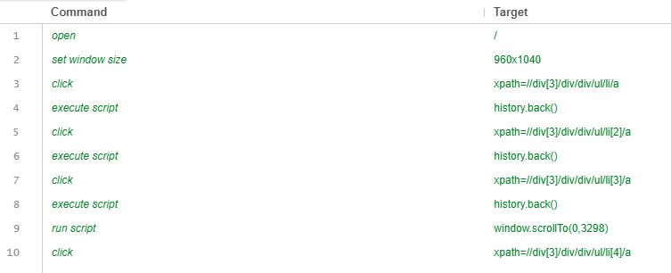
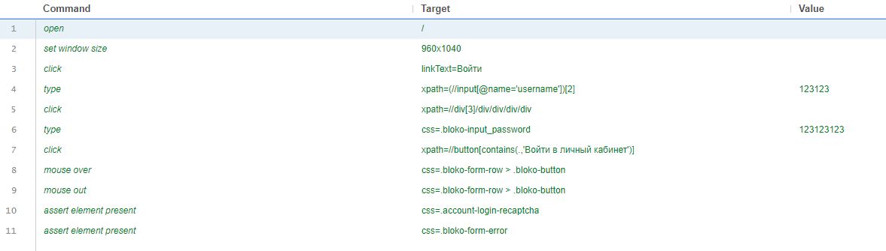
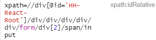
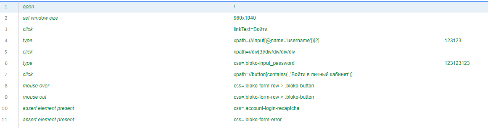
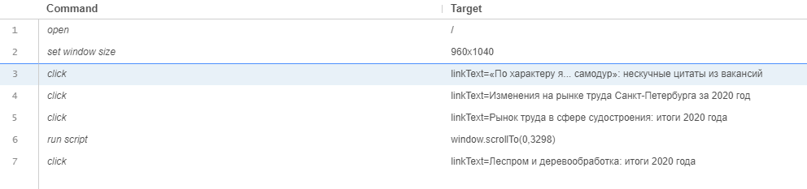
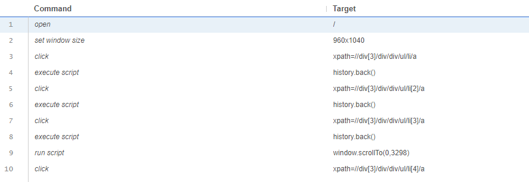
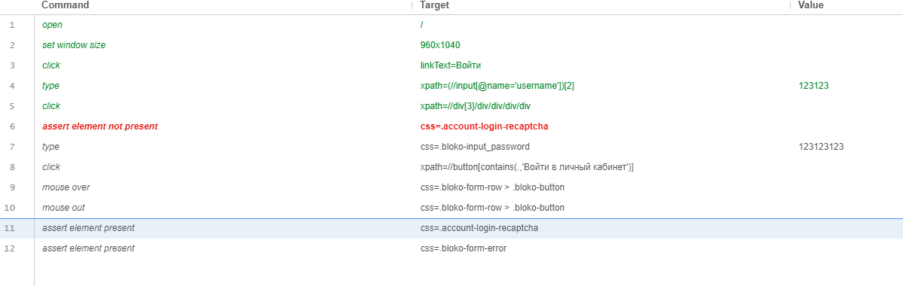

# Лабораторная работа №3 <br> &laquo;Тестирование программного обеспечения&raquo;

### Прецеденты

| Прецедент №1 | Создать резюме|
| ---- | ---- |
| Предусловие | Пользователь не должен быть авторизован |
| Действие | Нажимается кнопка `Создать резюме` на главной странице |

| Прецедент №2 | Переход в раздел QA|
| ---- | ---- |
| Предусловие | - |
| Действие | Нажимается кнопка `Вопросы и ответы` на главной странице в разделе "помощь" |

| Прецедент №3 | Изменение города |
| ---- | ---- |
| Предусловие | - |
| Действие | Нажимается кнопка `xpath=//button/div`, которая должна изменять город пользователя (самая верхняя левая) |

| Прецедент №4 | Поиск работы |
| ---- | ---- |
| Предусловие | - |
| Действие | Выполняется поиск работы через ввод на главной странице |

| Прецедент №5 | Новости |
| ---- | ---- |
| Предусловие | - |
| Действие | Последовательное нажатие первых 4-х новостей |

| Прецедент №6 | Вход в аккаунт |
| ---- | ---- |
| Предусловие | Пользователь не должен быть авторизован |
| Действие | Переход по кнопке войти |
| Верификация | Должны присутствовать поля ввода логина и пароля |

| Прецедент №7 | Неверный логин или пароль |
| ---- | ---- |
| Предусловие | Пользователь не должен быть авторизован |
| Действие | Переход по кнопке войти и ввода неправильного логина и пароля. Нажатие кнопки войти в аккаунт |
| Верификация | Должен выйти блок с подтверждением, что пользователь не робот |

### UseCase диаграмма



### Работа с Selenium IDE

**Общий вид:**



**Check list:**





### Пример генерации кода на Java
```java
public class OfferSearchTest {
  private static WebDriver driver;

  @BeforeAll
  static void setUp() {
    driver = new ChromeDriver();
  }

  @AfterEach
  public void tearDown() {
    driver.quit();
  }
  
  @Test
  public void offerSearch() {
    driver.get("https://spb.hh.ru/");
    driver.manage().window().setSize(new Dimension(960, 1040));
    driver.findElement(By.xpath("//input[@name='text']")).click();
    driver.findElement(By.xpath("//input[@name='text']")).click();
    {
      WebElement element = driver.findElement(By.xpath("//span/a/span"));
      Actions builder = new Actions(driver);
      builder.moveToElement(element).perform();
    }
    {
      WebElement element = driver.findElement(By.tagName("body"));
      Actions builder = new Actions(driver);
      builder.moveToElement(element, 0, 0).perform();
    }
    driver.findElement(By.xpath("//input[@name='text']")).sendKeys("Java");
    driver.findElement(By.xpath("//span[contains(.,'Найти работу')]")).click();
  }
}

```

### Описание тестовых сценариев

Для тестовых сценариев мы чаще пытались использовать XPath, так как, например, селекторы по
id могли быть невалидными из-за динамической генерации компонентов.

В нашем случае, фронтенд hh.ru был написан на фреймворке React:



Тем не менее, можно было столкнуться с некоторыми проблемами, зависящих от структуры DOM.
Например, при аутентификации мы не смогли выбрать поле инпута с паролем, из-за чего пришлось 
прибегнуть к использованию css-селектора:



Также selenium при записи мог использовать ссылки по значению, которое оно отображает:



Мы заменили их на поиск по XPath, что более валидно, так как заголовки новостей всегда могут меняться



Из интересного еще можно заметить использование скриптов. 
В нашем случае, он использовался для перехода на предыдущую страницу

Из сложностей еще весьма трудно тестировать элементы, которые как бы должны появиться после
какого-то действия. Но мы не можем проверить его через assert element not present, так как на самом деле
он есть, просто невидим. И это переходит в написание условия по поиску visible.

С таким мы столкнулись в прецеденте неверного логина. В этом случае возникало поле для подтверждения, что мы не робот:



### Вывод

Мы научились основам работы с Selenium IDE, который предоставляет весьма удобный интерфейс для написания тестов. Были 
использованы поиски по XPath, css-селектору и другим атрибутам html-тэгов.

Тем не менее, Selenium IDE имеет и ряд минусов. Например, одним из них является генерация Java-кода для JUnit.
При генерации используется JUnit 4, и, например, если в проекте уже используется 5-ый, то придется переписывать зависимости,
которые она генерирует. Также она недостаточно оптимизирует код. Она может создать совсем ненужные поля (vars, jsExec) или добавлять
неиспользуемые зависимости (FirefoxDriver)
