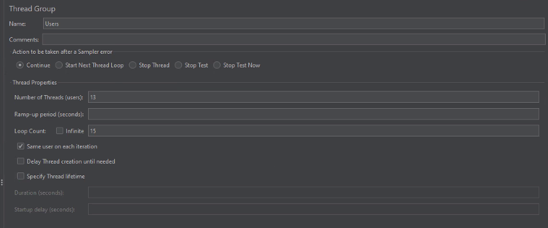

# Лабораторная работа №4 <br> &laquo;Тестирование программного обеспечения&raquo;

### Задание

С помощью программного пакета [Apache JMeter](http://jmeter.apache.org/) провести нагрузочное и стресс-тестирование веб-приложения в соответствии с вариантом задания.

В ходе нагрузочного тестирования необходимо протестировать 3 конфигурации аппаратного обеспечения и выбрать среди них наиболее дешёвую, удовлетворяющую требованиям по максимальному времени отклика приложения при заданной нагрузке (в соответствии с вариантом).

В ходе стресс-тестирования необходимо определить, при какой нагрузке выбранная на предыдущем шаге конфигурация перестаёт удовлетворять требованиями по максимальному времени отклика. Для этого необходимо построить график зависимости времени отклика приложения от нагрузки.


```
**Webapp properties:**

- First hardware configuration ($ 1800) URL - [http://aqua:8080?token=466636692&user=2077394554&conf=1](https://se.ifmo.ru/courses/appUrl);
- Second hardware configuration ($ 1900) URL - [http://aqua:8080?token=466636692&user=2077394554&conf=2](https://se.ifmo.ru/courses/appUrl);
- Third hardware configuration ($ 3700) URL - [http://aqua:8080?token=466636692&user=2077394554&conf=3](https://se.ifmo.ru/courses/appUrl);
- Maximum parallel sessions count - 13;
- Load average (requests per minute; per session) - 20;
- Maximum request processing timeout - 870 ms.
```


### Работа с Apache JMeter

1. Описание конфигурации JMeter для нагрузочного тестирования.

   План теста:

   

   Описание количества пользователей

   

   Параметры HTTP-запроса

   

2. **Графики пропускной способности приложения, полученные в ходе нагрузочного тестирования.**

   График пропускной способности при 13 запросах в секунду:

   

   График пропускной способности при 15 запросах в секунду:

   

   График пропускной способности при возникновении первой ошибки:

   

3. **Выводы по выбранной конфигурации аппаратного обеспечения.**

   *Была выбрана первая конфигурация.*

   Исходя из графиков можно понять, что при равномерном увеличении количества юзеров до 100, где-то в середине некоторые пользователи начали получать 503 ошибку Service is unavailable.

   Первая ошибка появляется при 19 пользователях.
   При количестве пользователей равного 19 система перестает удовлетворять условию максимально допустимого времени обработки запроса - 870 мс.

4. Описание конфигурации JMeter для стресс-тестирования.

   Описание конфигурации при прохождении стресс тестирования:

   

   Пример конфигурации при которой тест не прошёл:

   

5. График изменения времени отклика от нагрузки для выбранной конфигурации, полученный в ходе стресс-тестирования системы.

   

   

### Вывод

В ходе выполнения лабораторной работы было проведено нагрузочное тестирование для приложений 3-х конфигураций разной ценовой категории при помощи приложения apache jmeter . В ходе тестирования было выявлено приложение с  конфигурациями, которые удовлетворяют предоставленным требованиям и проведено стресс-тестирование для выбранного приложения, в ходе чего было определена максимальная пропускная способность выбранного приложения.